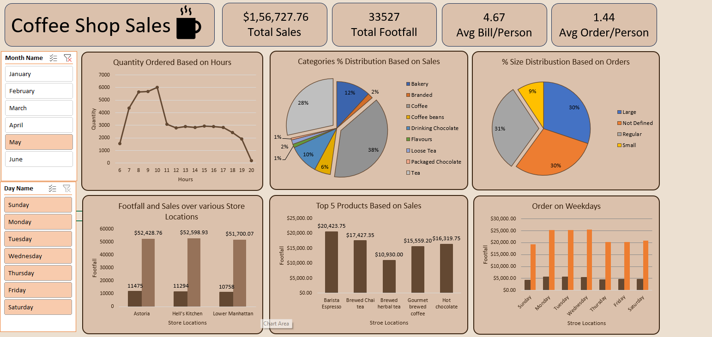

# Coffee Shop Sales Analysis

## 📌 Objective
The main objective of this project is to analyze retail sales data to gain 
actionable insights that will enhance the performance of the Coffee Shop — 
turning daily transactions into a clear read on what sells, when, and where.

## 🛠️ Tools Used
- Excel (Pivot Tables & Dashboard)
- Data Analysis

## 📁 Files in this Repository
- `Coffee_Shop_Sales.xlsx` — Raw transaction-level sales data (transaction ID, date, time, quantity, store, product, price)
- `coffee_shop_sales_dashboard.xlsx` — Interactive Excel dashboard with pivot tables and visuals
- `Coffee_Shop_Sales_Analysis_Redesigned.pdf` — Project brief and recommended analysis questions

## 🔍 Recommended Analysis
- How do sales vary by day of the week and hour of the day?
- Are there any peak times for sales activity?
- What is the total sales revenue for each month?
- How do sales vary across different store locations?
- What is the average price per order, per person?
- Which products are the best-selling in terms of quantity and revenue?
- How do sales vary by product category and type?

## 📊 Dataset Overview
The dataset includes transactions with the following fields:
`transaction_id`, `transaction_date`, `transaction_time`, `transaction_qty`, 
`store_id`, `store_location`, `product_id`, `unit_price`, `product_category`, 
`product_type`, `product_detail`

## 📊 Dashboard Preview
(Yahan apne dashboard ka screenshot daalo)

